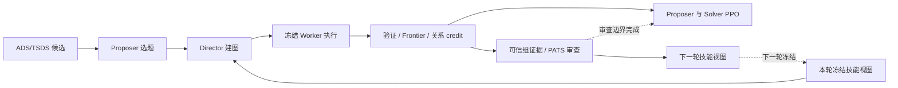

# PATS 与图自博弈训练的融合说明

本组件借鉴 [PATS 论文](https://arxiv.org/abs/2607.21419)及[官方实现](https://github.com/shi-yipeng/PATS)，为 Solver 的 Director 增加随训练表现调整的技能提示。详细契约见[主文档](PATS.md)，启用方式见[配置示例](../configs/pats.example.toml)。Worker 与 Refiner 参数保持冻结。

原主链中，[ADS/TSDS](../src/selfplay_graph_flowsteer/curriculum.py)根据离线难度、相似性和多样性准备候选，[Proposer](../src/selfplay_graph_flowsteer/selfplay.py)学习选题；[Solver Director](../src/selfplay_graph_flowsteer/director.py)逐步配置 Agent、模型、提示词及通信关系，调用 Worker 执行。任务验证器提供结果；Graph-local Frontier 利用局部图差异与可信复核评价选题，关系反事实比较固定图中指定关系的开关，形成局部 credit。两角色各自进入 [PPO 更新](../src/selfplay_graph_flowsteer/training.py)。

[PATS 控制器](../src/selfplay_graph_flowsteer/pats.py)插在采集轮次之间。它先收集可信的全失败、全成功及混合结果组，避免旧有高低分配对过滤漏掉最需要帮助的任务；未知奖励、基础设施故障和测试集不参与能力估计。[公开过程证据](../src/selfplay_graph_flowsteer/pats_evidence.py)包含真实动作、反馈、图关系和已用技能版本，不包含隐藏答案或思维链。

每个“数据集＋任务类型＋固定难度”有独立视图。难度不由当轮奖励反推；缺省为 `unspecified`，ADS 连续 NLL 不直接拆成作用域。每轮先计算各任务组平均分，再对组均值取平均；从零初始化的 EMA 按 `0.1×本轮均值＋0.9×旧值` 更新。二元奖励时它对应成功率，反映的是当前选题与提示条件下的表现。

| 模式 | 默认触发与行为 |
| --- | --- |
| EXPAND | EMA＜0.3，最多新增两张卡。 |
| REVISE | 0.3≤EMA＜0.85，修订指导，最多新增一张。 |
| COMPRESS | EMA≥0.85，禁止新增，严格减少实际提示 token。 |
| FORCED_PRUNE | 容量压力达到上限时优先触发，缩减至容量以内。 |

[Refiner](../src/selfplay_graph_flowsteer/pats_refiner.py)使用严格 JSON Schema 和 `E1/E2` 短证据别名；别名精确映射回证据哈希。每次编辑至少引用两个不同任务，整组 ADD/UPDATE/DELETE 原子校验，失败保留旧视图。公开动作、层级关系、工具权限和预算约束也进入审查提示；格式通过仍不证明技能正确或有益。

[检索与冻结](../src/selfplay_graph_flowsteer/skill_evolution_v2.py)复用原 SkillBank。新快照 `learned_first_v1` 优先选择 PATS 维护的卡（包括修订后的种子），各组内仍按 E5 排序；类型、工具、排除项和分数阈值继续生效。最终最多三张、默认不超过实际 Director tokenizer 的 1,024 token；超长卡跳过后继续补选。旧快照缺版本字段时保留原 E5 排序及 manifest；空作用域表示撤除，不回退种子。

同一比较组共享实际冻结提示及其哈希。采集记录带技能的原始 prompt、token IDs 和行为概率，[训练数据路径](../src/selfplay_graph_flowsteer/rollouts.py)原样保留这些上下文，PPO 按原 action mask 重算概率；新卡只进入后续轮次，关系反事实不重新规划。配置 `training_only` 后，普通推理和最终评估移除整个技能块；显式 `--skill-context on` 可覆盖此选择。

相对原有全局 SkillBank，增量是按策略表现维护作用域副本、控制指导容量并保证新指导实际暴露，减少不同任务互相覆盖。全局种子不被删除。使用账本按技能 ID、版本、数据集和作用域分别汇总，逐事件保存快照；历史记录只从原 manifest 补齐范围，不从当前状态猜测。使用相关性不等于因果收益，也不直接驱动 EMA。

SQLite 保存状态及每轮回执：相同输入重放幂等，变更配置、输入或运行归属会拒绝恢复；冻结文件和开关契约保护已完成采集。当前采用同步轮次维护，不允许提前异步采集下一轮。

截至 2026-09-12，已有 129 项去重针对测试通过；[独立真实 Refiner 验证](../state/pats-real-architecture-20260912/refiner-repair-validation/validation_summary.json)在三个作用域成功产生编辑。[96 题真实 E5 检索探针](../state/pats-real-architecture-20260912/refiner-repair-validation/learned_first_retrieval_probe.json)中，新卡命中从 AIME/NQ/Hotpot 的 0/4/13 题变为各 32 题，最大 409 token。这证明接入与暴露，不证明准确率提升。四轮真实实验仍在运行；本实现未复现论文完整训练配方或额外技能条件 SFT，也未建立同行比较优势。
